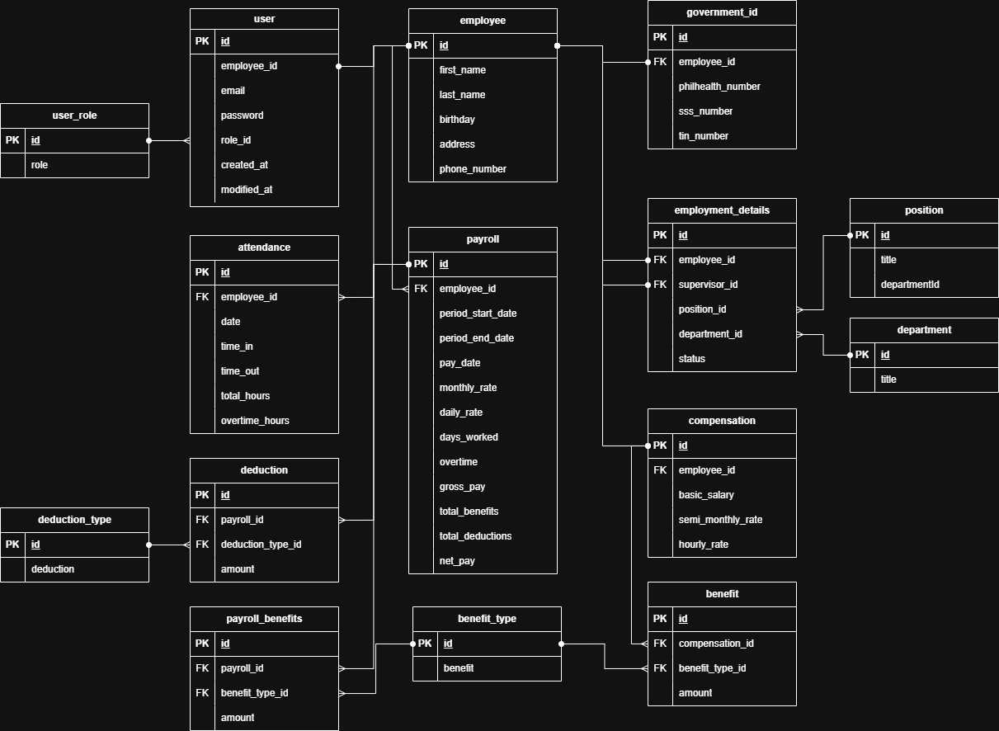

# MotorPH API


A comprehensive employee management and payroll system REST API built with Spring Boot. This project demonstrates backend development best practices and serves as preparation for software engineering internships.

## 🎯 Project Overview

MotorPH API is a full-featured Human Resources Information System (HRIS) that manages employee data, attendance tracking, and payroll processing. The system implements role-based access control, JWT authentication, and follows clean architecture principles.

## 🏗️ Architecture & Technology Stack

### Core Technologies
- **Java 21** - Modern Java LTS version with latest language features
- **Spring Boot 3.5.6** - Enterprise-grade application framework
- **Spring Data JPA** - Database abstraction and ORM
- **Spring Security** - Authentication and authorization
- **PostgreSQL** - Relational database management
- **JWT (JSON Web Tokens)** - Stateless authentication mechanism
- **Maven** - Dependency management and build automation

### Key Dependencies
- **Lombok** - Reduces boilerplate code
- **OpenCSV** - CSV file processing for data imports
- **Spring Validation** - Request validation
- **Spring Boot DevTools** - Development productivity tools
- **JJWT (JSON Web Token for Java)** - JWT token generation and validation

## 📁 Project Structure

```
motorph_api/
├── src/
│   ├── main/
│   │   ├── java/com/iodsky/motorph/
│   │   │   ├── MotorphApplication.java      # Application entry point
│   │   │   ├── attendance/                   # Attendance management module
│   │   │   ├── common/                       # Shared utilities and DTOs
│   │   │   ├── csvimport/                    # CSV import functionality
│   │   │   ├── employee/                     # Employee management module
│   │   │   ├── organization/                 # Department & Position management
│   │   │   ├── payroll/                      # Payroll processing module
│   │   │   └── security/                     # Authentication & Authorization
│   │   └── resources/
│   │       ├── application.yml               # Main configuration
│   │       └── application-local.yml         # Local development config
│   └── test/                                 # Unit and integration tests
├── db-init/                                  # Database initialization scripts
├── Dockerfile                                # Container configuration
├── pom.xml                                   # Maven dependencies
└── README.md
```

## 🗄️ Database Entity-Relationship Diagram



The database schema follows a normalized relational design with the following key entities and relationships:

### Core Entities

**Employee** (Central Entity)
- Primary entity containing personal information
- Has one-to-one relationships with:
  - `GovernmentId` - SSS, PhilHealth, TIN, Pag-IBIG numbers
  - `EmploymentDetails` - Department, position, supervisor, hire date, status
  - `Compensation` - Salary, allowances, deductions

**Attendance**
- Tracks employee clock in/out records
- Many-to-one relationship with Employee
- Fields: date, time in, time out, hours worked

**Payroll**
- Generated payroll records for employees
- Many-to-one relationship with Employee
- Calculated from attendance and compensation data
- Fields: period dates, gross pay, deductions, net pay

**Department** & **Position**
- Organizational structure entities
- Referenced by EmploymentDetails

**User** (Security)
- Authentication and authorization
- One-to-one with Employee
- Contains username, password (encrypted), and roles

## 🔑 Key Features

### 1. Employee Management
- CRUD operations for employee records
- Employee profile management with personal information
- Department and position assignment
- Supervisor relationships and hierarchies
- Government ID tracking (SSS, PhilHealth, TIN, Pag-IBIG)
- Compensation details management (salary, allowances)
- Advanced filtering by department, supervisor, and status
- Pagination support for large datasets
- CSV bulk import for employee data

### 2. Attendance Tracking
- Clock in/out functionality with automatic timestamp recording
- Attendance history by date range
- Employee-specific attendance records
- HR oversight of all attendance data across organization
- Date-based filtering and pagination

### 3. Payroll Processing
- Automated payroll calculation based on attendance and compensation
- Batch payroll generation for all employees in one operation
- Individual payroll processing for specific employees
- Payroll history tracking with period-based filtering
- Period-based payroll reports with pagination
- Integration with attendance data for accurate calculations
- Benefits and deductions management system

### 4. Security & Authentication
- JWT-based stateless authentication
- Role-based access control (RBAC) with method-level security
- Secure password hashing with BCrypt
- Protected API endpoints with authorization checks
- User session management through JWT tokens
- Token-based API security

### 5. User Management
- User account creation and management
- Role assignment and permission control
- Integration with employee records
- CSV bulk import for user accounts
- IT-role exclusive access for user administration

### 6. Data Import
- CSV file processing for bulk data imports
- Employee data import with validation
- User account bulk creation

### Payroll Calculation Details

The payroll system implements Philippine payroll standards with automated calculation of:

**Mandatory Deductions:**
- **SSS (Social Security System)** - Progressive contribution table based on monthly salary compensation
- **PhilHealth** - 3% premium rate with maximum cap of ₱1,800
- **Pag-IBIG (HDMF)** - 1-2% based on monthly compensation, capped at ₱100
- **Withholding Tax** - Progressive tax brackets according to TRAIN Law

**Gross Pay Calculation:**
- Based on attendance records (hours worked)
- Hourly rate derived from monthly salary
- Overtime and holiday pay support (when applicable)

**Benefits Management:**
- Rice subsidy
- Phone allowance
- Clothing allowance
- Other customizable benefits

**Net Pay Formula:**
```
Net Pay = Gross Pay + Total Benefits - (SSS + PhilHealth + Pag-IBIG + Withholding Tax)
```

## 🔐 User Roles & Permissions

The system implements a role-based access control system with the following roles:

- **HR** - Full access to employee management, attendance oversight, and organizational data
- **PAYROLL** - Access to payroll processing and generation
- **IT** - Access to employee information for system administration
- **EMPLOYEE** - Basic access to personal information, attendance, and payroll records

## 📡 API Endpoints

### Authentication
```
POST /api/auth/login          # User authentication (returns JWT token)
```

### Employee Management
```
POST   /api/employees         # Create new employee (HR only)
GET    /api/employees         # List all employees with pagination & filters (HR, IT, PAYROLL)
                              # Query params: page, limit, department, supervisor, status
GET    /api/employees/me      # Get authenticated employee's profile
GET    /api/employees/{id}    # Get employee by ID (HR only)
PUT    /api/employees/{id}    # Update employee (HR only)
DELETE /api/employees/{id}    # Delete employee (HR only)
POST   /api/employees/import  # Bulk import employees from CSV (HR, IT)
```

### Attendance
```
POST   /api/attendances               # Clock in/out (creates attendance record)
GET    /api/attendances               # Get all attendance records with pagination (HR only)
                                      # Query params: page, limit, startDate, endDate
GET    /api/attendances/me            # Get my attendance records with pagination
                                      # Query params: page, limit, startDate, endDate
GET    /api/attendances/employee/{id} # Get employee attendance (HR only)
                                      # Query params: page, limit, startDate, endDate
PATCH  /api/attendances/{id}          # Update attendance record (clock out)
```

### Payroll
```
POST   /api/payroll           # Generate payroll (PAYROLL role)
                              # Batch: omit employeeId to process all employees
                              # Single: include employeeId for specific employee
GET    /api/payroll           # Get all payroll records with pagination (PAYROLL role)
                              # Query params: page, limit, periodStartDate, periodEndDate
GET    /api/payroll/me        # Get my payroll records with pagination
                              # Query params: page, limit, periodStartDate, periodEndDate
GET    /api/payroll/{id}      # Get payroll by ID
```

### User Management
```
POST   /api/users             # Create new user account (IT only)
GET    /api/users             # List all users with pagination (IT only)
                              # Query params: page, limit, role
POST   /api/users/import      # Bulk import users from CSV (IT only)
```

## 🚀 Getting Started

### Prerequisites
- Java 21 or higher
- Maven 3.8+
- Docker Desktop (includes Docker Compose)
- Git

### Environment Variables

Create a `.env` file in the root directory based on `.env.template`. Required variables:

```env
# Spring Profile Selection
SPRING_PROFILES_ACTIVE=local  # Use 'local' for development, 'prod' for production

# Server Configuration
PORT=8001

# Local Database Configuration (for local profile)
LOCAL_DB=motorph
LOCAL_DB_HOST=localhost
LOCAL_DB_PORT=5432
LOCAL_DB_USER=postgres
LOCAL_DB_PASSWORD=your-password

# Cloud Database Configuration (for prod profile - AWS RDS)
CLOUD_DB=motorph
CLOUD_DB_HOST=your-rds-endpoint.amazonaws.com
CLOUD_DB_PORT=5432
CLOUD_DB_USER=postgres
CLOUD_DB_PASSWORD=your-secure-password

# JWT Configuration
JWT_SECRET_KEY=your-secret-key-here-minimum-256-bits
JWT_EXPIRATION=86400000  # 24 hours in milliseconds
```

### Local Development Setup

> **Note**: For local development, use `compose.db.yml` to run PostgreSQL in Docker and run the API on your host machine for faster feedback and hot-reload capabilities.

1. **Clone the repository**
```powershell
git clone <repository-url>
cd motorph_api
```

2. **Create .env file**
```powershell
# Copy the template file
Copy-Item .env.template .env

# Edit .env and fill in the required values, especially:
# - LOCAL_DB_PASSWORD
# - JWT_SECRET_KEY (minimum 256 bits for HS256)
# - JWT_EXPIRATION (e.g., 86400000 for 24 hours)
```

3. **Start the database with Docker Compose**
```powershell
docker compose --env-file .env -f compose.db.yml up -d
```

4. **Build the project**
```powershell
./mvnw clean install
```

5. **Run the application (local profile)**
```powershell
./mvnw spring-boot:run -Dspring-boot.run.profiles=local
```

The API will be available at `http://localhost:8001/api`.

### Running Tests
```powershell
./mvnw test
```

### Building for Production
```powershell
./mvnw clean package -DskipTests
```

The executable JAR will be generated in the `target/` directory.

## 🐳 Docker Support

The project includes Docker support for containerized deployment with Docker Compose.

### Docker Compose Configuration

The project includes two Docker Compose configurations:

1. **`compose.db.yml`** - Database only (for local development)
   - Runs PostgreSQL container
   - Exposes port 5432
   - Includes database initialization scripts

2. **`compose.yml`** - Full application stack (for production deployment)
   - Spring Boot API container
   - Configured to connect to external AWS RDS PostgreSQL (no local database container)
   - Watchtower for automatic container updates
   - Traefik reverse proxy integration (external network)

### Build Docker Image
```powershell
docker build -t motorph-api .
```

### Run with Docker Compose (Full Stack)
```powershell
# Ensure .env file is configured with production settings
docker compose --env-file .env up -d
```

### Run Database Only (Local Development)
```powershell
docker compose --env-file .env -f compose.db.yml up -d
```

The Dockerfile uses a multi-stage build:
- **Builder stage**: Eclipse Temurin JDK 21 for compilation
- **Runtime stage**: Eclipse Temurin JRE 21 for optimized deployment

## 🧪 Testing

The project includes comprehensive test coverage:

- **Unit Tests** - Service layer business logic
- **Test Coverage Areas**:
  - Employee Service
  - Attendance Service
  - Payroll Service
  - User Service

Run tests with:
```powershell
./mvnw test
```

## 📋 Project Roadmap

### Phase 1: Core Development ✅
- [x] Employee management system
- [x] Attendance tracking
- [x] Payroll processing
- [x] JWT authentication
- [x] Role-based authorization
- [x] CSV import functionality
- [x] Unit tests
- [x] User management system
- [x] Docker support with multi-stage builds
- [x] Multi-environment configuration (local/prod)

### Phase 2: AWS RDS Migration 📅
- [ ] **AWS RDS PostgreSQL Setup**

### Phase 3: AWS EC2 Deployment 📅
- [ ] **EC2 Instance Configuration**
- [ ] **Traefik Reverse Proxy Setup**
- [ ] **Deployment Pipeline**
  - Deploy application via Docker Compose
  - Configure Watchtower for automatic updates
  - Set up monitoring and logging

### Phase 4: Documentation & Enhancement 🔮
- [ ] OpenAPI/Swagger documentation
---

**Note**: This project is actively being developed as part of backend development practice for internship preparation. The focus is on implementing industry-standard practices, clean code, and scalable architecture.
